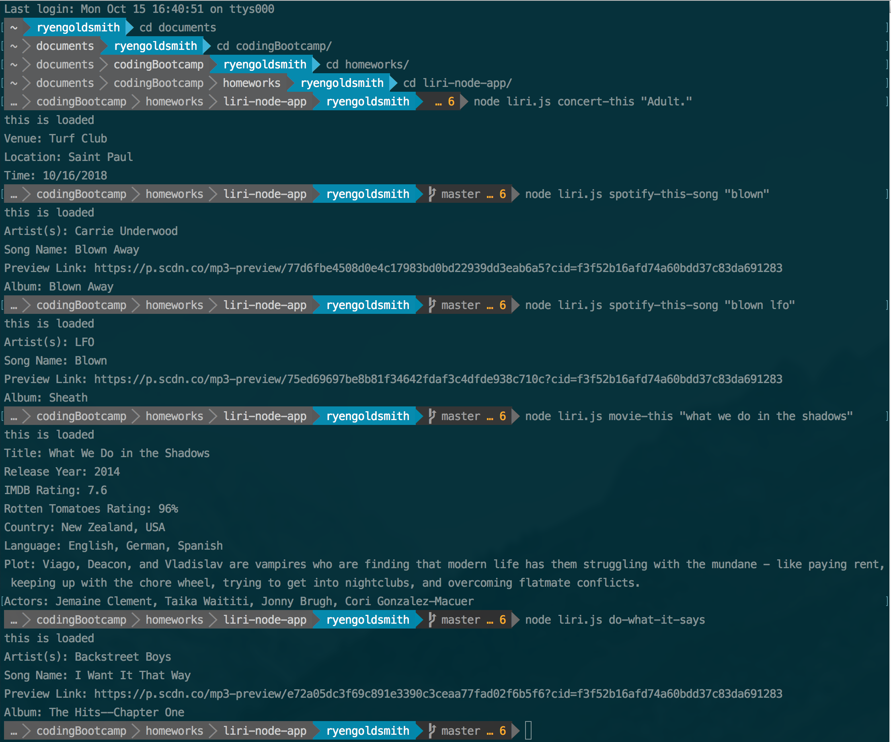

# liri-node-app

This project is a command line node app that allows you to look up information using API calls.

* Spotify allows you to look up information about a track that you enter.  ex: node liri.js spotify-this-song "U2 one" 

* OMDB will look up movie information.  ex: node liri.js movie-this "Alien"

* Bands In Town will give you concert information on a selected artist.  ex: node liri.js concert-this "Metallica"

* It can also read information in a text file to run these searches.  ex: node liri.js do-what-it-says

To use this, you will need to install node module packages and provide your own Spotify, BandsInTown, and OMDB keys to use the APIs.  

I have included a screenshot of what happens when you run the file with node.  liriWORKS.png.

